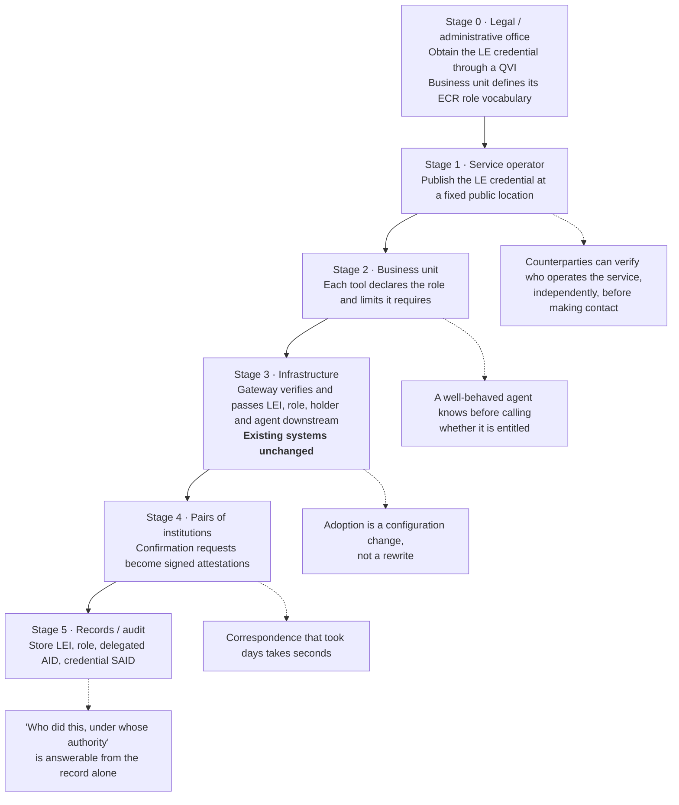
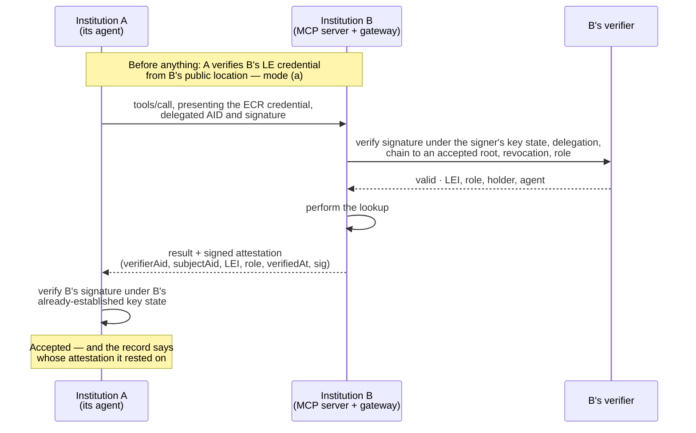

# Adopting Agent Identity in Public-Sector Institutions

**Audience:** policy and operational staff at government institutions
**Prerequisite reading:** none. No code appears in this document.
**中文摘要在文末。**

This document answers one question: if a government institution wants to let agents act — its own
agents, or other institutions' agents calling it — what has to change, and what does it adopt to
make that change?

## 1. The anchor: this has already been done with people

GLEIF has run a regulatory-filing pilot ([`GLEIF-IT/reg-pilot`](https://github.com/GLEIF-IT/reg-pilot)).
In it, a filer signs in with a vLEI ECR credential, uploads a signed filing, and the regulator's
`vlei-verifier` validates the credential chain before the filing is accepted. The regulator learns
which legal entity filed, under which role, with a credential that can be revoked.

That pilot has a person in front of a browser. This project extends the same trust structure to an
**agent** acting through MCP. The credentials are the same and the revocation mechanism is the same;
GLEIF's verifier can be the same too, though the reference deployment reads revocation from the
issuer's log directly while an upstream defect is open (`docs/upstream/`). What is new is where the credential travels: inside the protocol call rather
than inside a web session.

That continuity is the substance of the proposal. Nothing here asks an institution to adopt a novel
trust model — it asks it to use the one it is already being asked to accept for human filers, in the
one place where it is currently impossible.

## 2. Two ways to check an identity

Institutions already have both of these patterns. They are not new procedures; they are existing
procedures with a verifiable form.

### (a) Passive checking from a public location

The institution publishes its Legal Entity credential at a fixed, public address — the same idea as
a public key directory or a published seal. Anyone who wants to verify who operates a service
fetches it and checks it themselves.

The institution does nothing per verification. It publishes once. Every counterparty, every agent,
every partner institution can verify independently, at any time, including before making contact.
There is no request to process, no queue, and no per-verification cost.

### (b) Confirmation between institutions ("來函確認")

District office A writes to district office B to confirm a birth record. B checks its own records,
replies confirming, and A relies on B's reply. A does not re-derive the record; it trusts B's
confirmation, because B is a known and accountable institution.

The agent equivalent: institution A's agent calls institution B's MCP server. B returns its answer
together with a **signed attestation** — a statement saying "we verified this party; here is the
LEI, the role, and when we checked it." A verifies B's signature and relies on B's statement.

This is the concrete meaning of "agents make government more efficient." The correspondence-and-
confirmation procedure that exists today is not replaced by something unfamiliar; it becomes a
verifiable call that completes in a second instead of a week, and leaves a stronger record than the
paper one did — a signature rather than a letterhead.

**The honest caveat, stated to the institution up front:** relying on an attestation means relying
on the attesting institution's judgment, exactly as relying on a letter of confirmation does today.
The system enforces that the attesting institution must itself have been verified under mode (a)
first, and that every decision records whose attestation it rested on. What it cannot do is make B
careful. That was always true of the letter as well.

## 3. The adoption path

Six stages, numbered 0 to 5. Each is independently useful: an institution that stops after stage 2 has gained
something real, and nothing in a later stage is required to make an earlier one work.

### Stage 0 — Obtain a credential and define the role vocabulary

- **Who:** the institution's legal or administrative office obtains the LE credential through a
  Qualified vLEI Issuer. Each business unit defines its own ECR role names.
- **What changes:** nothing technical. This is a registration and a vocabulary decision.
- **The vocabulary is the substantive work.** "regulatory-filing", "record-lookup",
  "permit-issuance" — these are the names that will appear in every authorization decision and every
  audit record afterwards. They should be chosen by the business unit that owns the process, not by
  an IT department, and they should match how the unit already describes who may do what.

### Stage 1 — Publish the institution's credential

- **Who:** whoever operates the institution's MCP server.
- **What changes:** the server publishes its LE credential at a fixed public location.
- **Effect:** any counterparty can establish who operates the service, independently, before
  contacting it. This is mode (a), and it costs the institution nothing per verification.

### Stage 2 — Declare which tools need which role

- **Who:** the business unit, expressed by whoever maintains the server.
- **What changes:** each tool that requires identity declares the role and any limits it requires —
  in the service's own published description, where callers already read it.
- **Effect:** a well-behaved agent can determine **before calling** whether it is entitled. Failed
  attempts stop arriving. The declared permission and the enforced permission are the same object,
  so they cannot drift apart.

### Stage 3 — Put verification at the gateway

- **Who:** the infrastructure team.
- **What changes:** an authorization gateway in front of existing systems performs the verification
  and passes the established facts downstream as ordinary request headers: the LEI, the role, the
  credential holder and the acting agent, plus a record of the checks behind them — five headers in
  `examples/regulator/` (`x-vlei-lei`, `x-vlei-role`, `x-vlei-holder-aid`, `x-vlei-delegate-aid`,
  `x-vlei-report`).
- **Effect:** **existing systems are not modified.** They read a header, as they already do for
  every other authentication scheme they sit behind. This is the stage that determines whether
  adoption is a procurement question or a rewrite, and `examples/regulator/` demonstrates the
  gateway shape end to end: a filing server containing no identity code at all.

### Stage 4 — Move inter-institution checks to attestations

- **Who:** pairs of institutions that already correspond.
- **What changes:** a confirmation request becomes a call that returns a signed attestation.
- **Effect:** mode (b). Correspondence that takes days takes seconds, and the resulting record is
  cryptographically verifiable rather than a scanned letter.

### Stage 5 — Record identity in the audit trail

- **Who:** the records or audit function.
- **What changes:** audit records store the LEI, the role, the delegated agent identifier, and the
  credential identifier, instead of an account name.
- **Effect:** "which organization did this, under whose authority, with what mandate" becomes
  answerable from the record alone, after the fact, without asking the counterparty.

### The path, in one picture

Each stage is independently useful. An institution that stops after stage 2 keeps everything stages
1 and 2 gave it, and stage 4 is the only one that needs a counterpart.

### Mode (b) in sequence

The order matters. A verifies B under mode (a) **first**; an attestation from a party whose own
identity has not been established is worth nothing, and the software refuses to accept one.

## 4. What an institution actually adopts

| Recipient | What they adopt | Effort |
|---|---|---|
| Agents | A skill and a software package | The skill is a document; the package is a dependency |
| Institution systems | A gateway configuration template — **or** the package, if the team prefers to embed it | Gateway: no change to existing systems. Package: a small change in one place |
| Business units | An ECR role vocabulary | A decision, not a deployment |

There is no new protocol to standardize, no MCP core change to wait for, and no dependency on any
other institution adopting first. An institution that adopts alone still gains stages 1–3 and 5.
Stage 4 is the only one that requires a counterpart, and it degrades gracefully: where the other
institution has not adopted, mode (a) still works.

## 5. What the institution gets

| Question | Today | After adoption |
|---|---|---|
| Who filed this? | An account, held by a person, in a system | An LEI, a role, and a delegated agent identifier, verifiable after the fact |
| Someone's authority changed | An account is edited; downstream systems learn later, or never | The credential is revoked at source; every relying party sees it at the next check |
| A new registration system is built | Identity is rebuilt again, differently | The same credentials are accepted; the new system reads the same headers |
| Integration with existing identity | Separate, parallel to everything else | vLEI answers *which organization*; existing sign-on still answers *which user*. Both, not either |
| Audit record | An account name, meaningful only inside one system | LEI, role, delegated AID, credential identifier — meaningful to an auditor who was never given access to that system |

The fourth row is the one most likely to be misread, so it is worth stating directly: **this does
not replace existing user authentication.** An institution that drops user sign-on because it now
has organizational identity has weakened itself. The two answer different questions, and a
high-value action should require both.

## 6. Limits, stated plainly

- **Verifiable is not trustworthy.** A valid credential proves an organization asserted a role for
  someone. It does not prove the request is legitimate, correct, or wise. Authorization policy
  remains the institution's own work, and this makes that policy enforceable — it does not write it.
- **LEIs are issued to legal entities, not to private individuals.** A citizen acting personally has
  no LEI and will not acquire one. This addresses organization-to-organization interaction:
  institutions, companies, associations. It is not a citizen identity scheme, and should not be
  presented as one.
- **There is a cost, and it recurs.** LEI registration carries an annual fee, as does vLEI
  credential issuance through a Qualified vLEI Issuer, on top of the operational work of managing
  role vocabularies and revocation. One thing worth knowing before treating this as a blocker:
  GLEIF's **Validation Agent** framework lets a financial institution perform the verification
  inside the KYC process it already runs for a client, so an entity that banks somewhere may be able
  to obtain its credentials through an existing relationship rather than as a separate procurement.
- **The QVI ecosystem is still expanding.** The set of Qualified vLEI Issuers is growing but finite,
  and coverage varies by jurisdiction. This is a live constraint on how fast an institution can move
  past stage 0, and it should be checked before a timeline is committed to.
- **The demonstration uses a self-configured root of trust.** Real KERI, real ACDC, real
  revocation — but the root is one we control, not GLEIF's. Every claim in the demonstration
  holds; the trust anchor in production would be GLEIF's, and the demonstration says so wherever it
  is shown.
- **Agent delegation conventions are not yet settled.** This project uses a delegated AID created
  under the ECR holder's key event log. It is a reasonable reading of the existing mechanisms rather
  than a ratified pattern, and confirming it is one of the requests this project brings to GLEIF.

---

## 中文摘要

**問題。** MCP 每一層驗證的都是網域控制權（TLS、OAuth 的 `iss` 與 `client_id`）或使用者身分
（OAuth 的 `sub`），沒有一層驗證法人身分；`clientInfo` 是自報的，規格明示不得作為信任依據。
人在迴路中時這沒有問題——負責的是那個人。agent 自主執行、跨機關呼叫時，負責的一方在協定中
不存在。

**已有的基礎。** GLEIF 的監理申報試點（reg-pilot）已經讓申報方以 vLEI ECR 憑證登入、上傳簽章
檔案、由 vlei-verifier 查驗。那是人透過瀏覽器；本案把同一套憑證、同一個驗證器、同一套撤銷機制
延伸到 agent 透過 MCP。機關不需要接受一個新的信任模型，只是把已經要接受的那一個，用在目前做
不到的地方。

**兩種查驗方式，機關本來就都有。**

- **公開區域被動查驗**：機關把 LE 憑證公開在固定位置（類似公鑰目錄），誰要查誰自己去查、自己
  驗。機關公布一次，之後每次查驗都不需要機關做任何事，也沒有任何成本。
- **機關間來函確認**：區公所 A 向區公所 B 來函調閱，B 回覆確認，A 信任 B 的回覆。對應到 agent：
  A 的 agent 呼叫 B 的 MCP server，B 回傳帶簽章的確認書，A 驗過 B 的簽章後採信。這就是
  「加速政府效率」的具體意義——原本的來函調閱流程沒有被換掉，而是變成幾秒鐘完成、且留下比紙本
  更強的紀錄。誠實的但書：採信確認書等於採信 B 的判斷，這一點和今天的來函完全一樣；系統能強制
  的是「B 自己必須先被驗過」與「每筆決定都記錄依據的是誰的確認」，不能替 B 把關。

**導入分五階段，每一階段單獨就有用，停在第二階段也有收穫。** 階段 0 取得 LE 憑證、由業務單位
自己訂 ECR 角色詞彙（這是最實質的工作，該由懂流程的單位訂，不是 IT 訂）；階段 1 公開機關的
LE 憑證；階段 2 需要身分的工具在對外說明中宣告所需角色與範圍，agent 呼叫前就能自己判斷有沒有
資格；階段 3 驗證放在閘道，**既有系統不必改**，只讀閘道傳來的標頭；階段 4 機關間查驗改為
attestation；階段 5 稽核紀錄改記 LEI、角色、委任 AID、憑證識別碼。

**用什麼納入。** 給 agent 的是一份 skill 加一個套件；給機關系統的是閘道設定範本（不改既有系統），
或套件（改一個地方）；給業務單位的是 ECR 角色定義。沒有新協定要標準化，不必等 MCP 核心改版，
也不必等別的機關先動——單獨導入仍然拿得到階段 1–3 與 5。

**限制要講清楚。** 可驗證不等於可信賴，授權政策還是機關自己的事；LEI 只發給法人，不發給以
私人身分行動的自然人，這不是國民身分方案；LEI 與 vLEI 都有年費——但 GLEIF 的 Validation Agent
制度允許金融機構在既有 KYC 流程中協助客戶取得，有往來銀行的機構可能不必另外走採購；QVI 生態
仍在擴展，各法域覆蓋不一，排時程前要先確認；本案的示範用自架信任根——KERI、ACDC、驗證器、撤銷都是真的，只有根是我們自己的，
正式環境會是 GLEIF 的，所有展示場合都會標明；agent 委任的慣例尚未定案，本案用 ECR 持有人 KEL
下的委任 AID，這是對既有機制的合理解讀而非已認可的模式，確認這一點正是本案要向 GLEIF 提出的
請求之一。
