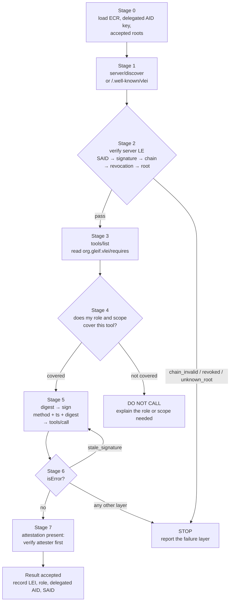

# vLEI Identity Workflow

A staged procedure for a session with an MCP server that declares `org.gleif.vlei/identity`.

Each stage is self-contained: it takes defined input, performs its own checks against its own source
of truth, and has an explicit pass condition. A stage is entered only when the previous stage passed.
Nothing is deferred to "we'll find out when the call fails" — the design goal is that every failure is
detected at the earliest stage where the information to detect it exists.

Read `SKILL.md` in this directory for the rules each stage enforces and for the response to each
failure layer.

---

## Stage 0 — Load credentials and keys

**Input:** configured credential path, key store path, accepted roots, verifier URL.

**Checks**
- The ECR credential file exists and parses as a CESR-encoded ACDC.
- The signing key is present in the key store, and its AID matches either the ECR holder's AID or a
  delegated AID under that holder's KEL.
- `acceptedRoots` is non-empty.
- The verifier is reachable, or offline fallback verification is configured.

**Pass condition:** a usable credential, a usable signing key, and at least one accepted root.

**On failure:** stop before connecting. Report which of the four is missing. An empty
`acceptedRoots` is a configuration error, not a default-to-accept-anything condition.

---

## Stage 1 — `server/discover`

**Input:** server URL.

**Checks**
- Read `serverInfo.extensions["org.gleif.vlei/identity"]`.
- Obtain the server's LE credential from the result's `_meta["org.gleif.vlei/credential"]`, or, if
  absent, fetch `discovery.wellKnown`.
- Record which source the credential came from — it appears in the audit record.

**Pass condition:** an LE credential has been obtained, or the server has been established to present
none.

**On failure (no extension declared, no credential anywhere):** the server is **unverified**. Do not
call it verified. Apply the configured policy: warn and continue, or stop. Skip to Stage 3 only if
policy permits continuing.

---

## Stage 2 — Verify the LE credential

**Input:** the LE credential from Stage 1, `acceptedRoots`.

**Checks**, in this order, because each one makes the next meaningful:
1. **Recompute the SAID** of the credential and confirm it matches the one presented → otherwise
   `chain_invalid`. Nothing below means anything until the document is the document it claims to be.
2. **Verify the issuer's signature** over the credential → otherwise `chain_invalid`.
3. **Walk the chain** along the `e` edges: ECR → LE → QVI → root, validating each ACDC's schema and
   each issuer's KEL → otherwise `chain_invalid`.
4. **Check revocation** for every credential in the chain, in the issuer's TEL → otherwise
   `revoked`.
5. **Confirm the terminating root is in `acceptedRoots`** → otherwise `unknown_root`.
6. If the discover result carried a signature, verify it under the server's AID and check freshness.

**Pass condition:** all six.

**On failure:** **stop.** Report the failure layer by name. Do not call any tool on this server,
including public ones. An organization that cannot prove it is who it claims is not one to send a
member's email address to.

Cache the result per the configured `ttlMs`. Note that a revocation takes effect no later than cache
expiry; for high-value tools the TTL should be zero.

---

## Stage 3 — `tools/list`

**Input:** a verified (or explicitly-unverified-and-permitted) session.

**Checks**
- For each tool, read `_meta["org.gleif.vlei/requires"]`.
- Build the set of tools that need a credential and, for each, the required `role` and `scope`.
- Tools without that key are public.

**Pass condition:** the requirement map is built. This stage does not fail; a server with no
protected tools yields an empty map.

---

## Stage 4 — Entitlement check before choosing a tool

**Input:** the requirement map from Stage 3; the role and scope carried by your own ECR.

**Checks**, for the tool the model intends to call:
- Does the tool require a credential at all? If not, go to Stage 5 without presenting one.
- Does your ECR role satisfy the required `role`?
- Do the arguments you intend to send fall inside the tool's declared `scope`?

**Pass condition:** role satisfied and arguments within scope.

**On failure:** **do not call.** Tell the user which role or limit is required, which you hold, and
that a new ECR must be issued by their legal entity. This is the stage that makes the permission
useful — it is declared in the schema precisely so the decision can be made here rather than by
attempting the call.

---

## Stage 5 — Sign and call

**Input:** the tool name, the arguments, the ECR credential, the delegated AID, the signing key.

**Actions**
1. Canonicalize `params` with RFC 8785, **excluding `_meta`**.
2. `digest = base64url(sha256(canonical))`.
3. `ts` = now, RFC 3339, UTC.
4. Sign `method + "\n" + ts + "\n" + digest`.
5. Attach to `params._meta`: the ECR credential, the delegated AID, and the signature.
6. Send.

**Pass condition:** the request is sent with all four `_meta` members present.

**Note:** arguments must not change between step 1 and step 6. Any change produces
`digest_mismatch` at the counterparty, which is the intended behavior and is not retryable.

---

## Stage 6 — Handle the response

**Input:** the tool result.

**Checks**
- `isError: false` → the call succeeded. Record the LEI, role, delegated AID, and credential SAID
  that were presented, for the audit trail.
- `isError: true` → read the named failure layer and apply the response from `SKILL.md` §4:
  - `stale_signature` → return to Stage 5 and retry **once**.
  - `scope_exceeded` → you may offer the user a retry with in-scope arguments; ask first.
  - every other layer → stop and report.
- JSON-RPC error `-32021` → the extension was not declared at `initialize`. This is a configuration
  problem; reconnect with the capability declared.

**Pass condition:** the result was either consumed or the failure was reported with its layer named.

---

## Stage 7 — Attestation handling (mode (b))

**Entered when** a result carries `_meta["org.gleif.vlei/attestation"]`.

**Checks**
1. Verify the attesting party's own identity under Stages 1–2 — an attestation from an unverified
   party is worth nothing.
2. Verify the attestation's signature under `verifierAid`'s key state.
3. Check `verifiedAt` against the configured acceptable age for attestations.
4. Confirm `subjectAid` is the party the attestation was requested about.

**Pass condition:** all four.

**On success:** accept the statement, and record **whose** attestation it was. The user is trusting
that party's verification, not one you performed.

**On failure:** discard the attestation. Do not fall back to accepting the claim unverified.

---

## Stage map

The single loop back from stage 6 to stage 5 is the only retry in the whole procedure. Every other
failure is a state of the world that a retry cannot change.
